# `tests/integration/clap/security_tests.rs`

Source SHA-256: `389abea39e584457f07466eba08c8c2cc61b8ca4e7932929049f4912c8bb81e8`

```mermaid
classDiagram
    class struct_EnvVarGuard {
      <<struct>>
      +"key: &'static str"
      +"previous: Option~std::ffi::OsString~"
    }
    class fn_test_path_traversal_patterns {
      <<fn>>
    }
    class fn_test_symlink_attack_scenarios {
      <<fn>>
    }
    class fn_test_absolute_path_escaping {
      <<fn>>
    }
    class fn_test_env_var_injection_prevention {
      <<fn>>
    }
    class fn_test_command_injection_in_paths {
      <<fn>>
    }
    class fn_test_null_byte_injection {
      <<fn>>
    }
    class fn_test_unicode_normalization_attacks {
      <<fn>>
    }
    class fn_test_mixed_path_separators_windows {
      <<fn>>
    }
    class fn_test_resource_exhaustion_deep_nesting {
      <<fn>>
    }
    class fn_test_file_write_race_conditions {
      <<fn>>
    }
    class fn_test_write_permission_validation {
      <<fn>>
    }
    note "Drop for EnvVarGuard"
    note "EnvVarGuard"
```

## Dependencies

- `serial_test::serial`
- `std::env`
- `std::fs`
- `std::os::unix::fs::PermissionsExt`
- `std::path::PathBuf`
- `std::sync::{Arc, Mutex}`
- `std::thread`
- `tempfile::TempDir`

## Standing

- Structural parse: `ALIVE`
- Runtime behavior: `UNKNOWN`
