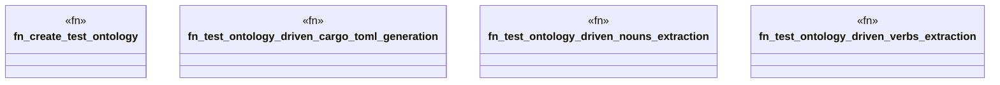

# `tests/integration/clap_noun_verb_ontology_test.rs`

Source SHA-256: `16dea0ae171ffb919d524023e8ef2970878551611358693ec0a433c31f546ccd`

## Dependencies

- `assert_fs::TempDir`
- `chicago_tdd_tools::test`
- `ggen_core::{Graph, Template}`
- `std::fs`
- `std::path::Path`
- `tera::Context`

## Standing

- Structural parse: `ALIVE`
- Runtime behavior: `UNKNOWN`
