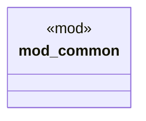

# `tests/integration/code_generation_tests.rs`

Source SHA-256: `cd1db8f4971f3275a1eb35722c04ad0498a6ce4db71dd3df419f0b184825dc7a`

## Dependencies

- `chicago_tdd_tools::test`
- `common::{create_temp_dir, sample_template_content, sample_template_vars, write_file_in_temp}`
- `ggen_core::{GenContext, Generator, Pipeline, Template}`
- `std::collections::BTreeMap`
- `std::fs`
- `std::path::PathBuf`
- `tera::Context`

## Standing

- Structural parse: `ALIVE`
- Runtime behavior: `UNKNOWN`
