# `tests/integration/compilation_errors_verification.rs`

Source SHA-256: `da6241ad4e1f6a260786a159b63127dd3279e598f49ad051a2a9ee2dfd803462`

```mermaid
classDiagram
    class fn_print_item {
      <<fn>>
    }
    class fn_get_length {
      <<fn>>
    }
    class trait_Parser {
      <<trait>>
      +"parse(s: &str) -~ Self"
    }
    class struct_IntParser {
      <<struct>>
    }
    class struct_FloatParser {
      <<struct>>
    }
    class fn_create_int_parser {
      <<fn>>
    }
    class fn_use_iterator {
      <<fn>>
    }
    class trait_Storage {
      <<trait>>
    }
    class struct_StringStorage {
      <<struct>>
      +"data: String"
    }
    class mod_tests {
      <<mod>>
    }
    note "Parser for FloatParser"
    note "Parser for IntParser"
    note "Storage for StringStorage"
```

## Dependencies

- `std::fmt::Display`
- `std::iter::Iterator`
- `std::marker::PhantomData`
- `super::*`

## Standing

- Structural parse: `ALIVE`
- Runtime behavior: `UNKNOWN`
