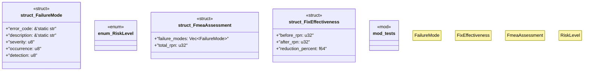

# `tests/integration/fmea_risk_assessment.rs`

Source SHA-256: `8b8820958b26ba1088de21cf85024ba9b6e720da95ef116138ff2c03523c3d74`

## Dependencies

- `std::collections::HashMap`
- `super::*`

## Standing

- Structural parse: `ALIVE`
- Runtime behavior: `UNKNOWN`
