# `tests/integration/full_cycle_container_validation.rs`

Source SHA-256: `da04a011605c2a5734c998e9b61d07d706052cb17041ed3e154eb38315c005b9`

```mermaid
classDiagram
    class mod_common {
      <<mod>>
    }
    class fn_full_cycle_container_validation {
      <<fn>>
    }
    class struct_ProjectSnapshot {
      <<struct>>
      +"file_count: usize"
      +"dir_count: usize"
      +"git_status_hash: String"
    }
    class fn_capture_project_snapshot {
      <<fn>>
    }
    class fn_marketplace_init_to_publish {
      <<fn>>
    }
    class fn_run_marketplace_lifecycle_container {
      <<fn>>
    }
    class fn_concurrent_full_cycle_validation {
      <<fn>>
    }
    class fn_run_build_container {
      <<fn>>
    }
    class fn_run_marketplace_container {
      <<fn>>
    }
    class fn_run_git_hooks_container {
      <<fn>>
    }
    class fn_run_validation_container {
      <<fn>>
    }
```

## Dependencies

- `chicago_tdd_tools::testcontainers::{ exec::SUCCESS_EXIT_CODE, ContainerClient, GenericContainer, TestcontainersResult, }`
- `common::require_docker`
- `std::process::Command`
- `std::sync::Arc`
- `std::thread`

## Standing

- Structural parse: `ALIVE`
- Runtime behavior: `UNKNOWN`
