# `tests/integration/gemba_walk_verification.rs`

Source SHA-256: `bbfc2a99f80cded61652ff848c90e4629cba5e6e148db36381423947b9147c24`

```mermaid
classDiagram
    class mod_test_state {
      <<mod>>
    }
    class trait_TestFixture {
      <<trait>>
      +"setup() -~ Self::Data"
      +"execute(data: Self::Data) -~ Self::Result"
      +"teardown(result: Self::Result) -~ bool"
    }
    class trait_ParametricTest {
      <<trait>>
      +"run(&self, input: Self::Input) -~ Self::Output"
    }
    class struct_TestData {
      <<struct>>
      +"name: &'a str"
      +"scenario: &'a str"
      +"expected_duration_ms: u64"
    }
    class struct_GembaScore {
      <<struct>>
      +"observability: u8"
      +"isolation: u8"
      +"assertion_clarity: u8"
      +"edge_coverage: u8"
      +"performance: u8"
      +"reliability: u8"
      +"coverage: u8"
      +"maintainability: u8"
    }
    class struct_TestContext {
      <<struct>>
      +"_state: std::marker::PhantomData~State~"
      +"start_time: Option~Instant~"
      +"traces: Arc~Mutex~Vec~String~~~"
    }
    class mod_tests {
      <<mod>>
    }
    note "GembaScore"
    note "TestContext~test_state::Completed~"
    note "TestContext~test_state::Executing~"
    note "TestContext~test_state::Initialized~"
    note "TestContext~test_state::Uninitialized~"
```

## Dependencies

- `std::sync::Arc`
- `std::time::{Duration, Instant}`
- `super::*`
- `tokio::sync::Mutex`

## Standing

- Structural parse: `ALIVE`
- Runtime behavior: `UNKNOWN`
