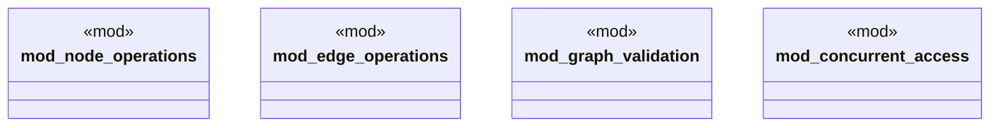

# `tests/integration/graph/core_operations_test.rs`

Source SHA-256: `35bb6e47b9fbebfa53a2cd8e72ff2f71dd24883bea57738ef6c1236e71dc30e2`

## Dependencies

- `anyhow::Result`
- `ggen_core::graph::{Graph, Node, Edge, NodeId, EdgeId, GraphError}`
- `std::sync::Arc`
- `std::thread`
- `super::*`

## Standing

- Structural parse: `ALIVE`
- Runtime behavior: `UNKNOWN`
