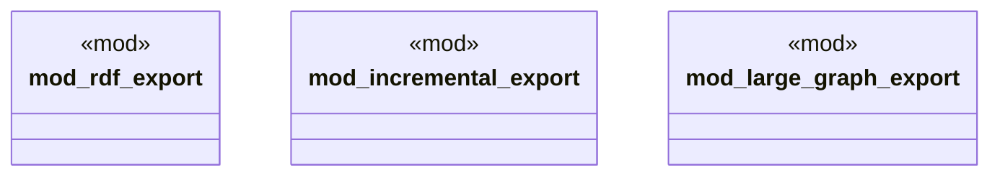

# `tests/integration/graph/export_operations_test.rs`

Source SHA-256: `7670757ac97f041c08fe50f420972d4df196a8bb6f6e66fcf80d41be1c6fa5f4`

## Dependencies

- `anyhow::Result`
- `ggen_core::graph::{Graph, RdfFormat}`
- `std::fs`
- `super::*`
- `tempfile::TempDir`

## Standing

- Structural parse: `ALIVE`
- Runtime behavior: `UNKNOWN`
