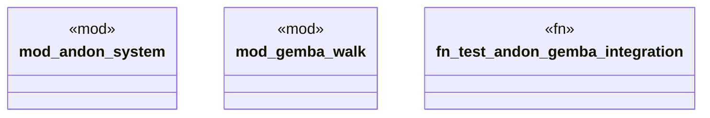

# `tests/integration/lean_quality_tests.rs`

Source SHA-256: `e253585a7e9a6131a41c2fae39a6ec431b49382301d70fab7ca95bdd604e1286`

## Dependencies

- `std::collections::HashMap`
- `std::path::PathBuf`
- `std::time::SystemTime`

## Standing

- Structural parse: `ALIVE`
- Runtime behavior: `UNKNOWN`
