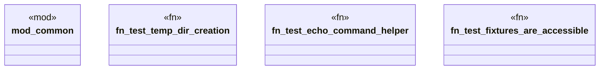

# `tests/integration/lifecycle_simple_tests.rs`

Source SHA-256: `16ce557facef83080b74fa0cae78991cc4237d3b657fe21fd12d17bcce8c2dca`

## Dependencies

- `anyhow::Result`
- `common::{create_temp_dir, echo_command}`
- `common::{sample_make_toml, sample_template_content}`

## Standing

- Structural parse: `ALIVE`
- Runtime behavior: `UNKNOWN`
