# `tests/integration/lifecycle_tests.rs`

Source SHA-256: `c80020ff99656ecf348194942826dc09ab68f2aa791360b6d087fe14324863ea`

```mermaid
classDiagram
    class mod_common {
      <<mod>>
    }
    class fn_test_single_phase_execution {
      <<fn>>
    }
    class fn_test_phase_with_working_directory {
      <<fn>>
    }
    class fn_test_phase_execution_failure {
      <<fn>>
    }
    class fn_test_complete_lifecycle_pipeline {
      <<fn>>
    }
    class fn_test_pipeline_with_phase_names {
      <<fn>>
    }
    class fn_test_state_persistence {
      <<fn>>
    }
    class fn_test_state_recovery_after_failure {
      <<fn>>
    }
    class fn_test_before_hooks_execution {
      <<fn>>
    }
    class fn_test_after_hooks_execution {
      <<fn>>
    }
    class fn_test_phase_dependencies_respected {
      <<fn>>
    }
    class fn_test_cache_hit_skips_phase {
      <<fn>>
    }
    class fn_test_pipeline_completes_in_reasonable_time {
      <<fn>>
    }
```

## Dependencies

- `anyhow::Result`
- `chicago_tdd_tools::test`
- `common::{create_temp_dir, sample_make_toml, write_file_in_temp}`
- `ggen_core::lifecycle::{ load_make, load_state, run_phase, run_pipeline, save_state, Context, LifecycleState, Make, PhaseBuilder, Project, }`
- `std::collections::BTreeMap`
- `std::fs`
- `std::sync::Arc`

## Standing

- Structural parse: `ALIVE`
- Runtime behavior: `UNKNOWN`
