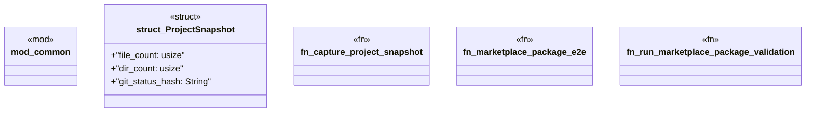

# `tests/integration/marketplace_package_e2e.rs`

Source SHA-256: `792cffd276d419b5280d9346f6a2c0c021a7ccea77ef9eb154084d335b3f1b25`

## Dependencies

- `chicago_tdd_tools::testcontainers::{ exec::SUCCESS_EXIT_CODE, ContainerClient, GenericContainer, TestcontainersResult, }`
- `common::require_docker`
- `std::process::Command`

## Standing

- Structural parse: `ALIVE`
- Runtime behavior: `UNKNOWN`
