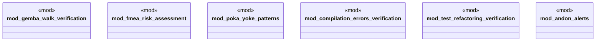

# `tests/integration/mod.rs`

Source SHA-256: `9b40d6855868694ee88263a5253f221d83e6c67dc51a8993d0e24abfe42046f5`

## Dependencies

- None observed.

## Standing

- Structural parse: `ALIVE`
- Runtime behavior: `UNKNOWN`
