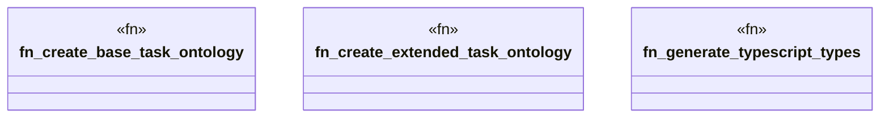

# `tests/integration/nextjs_ontology_sync.rs`

Source SHA-256: `416136ef0b63bf5f1d45eca905cc434d155c22e6f426ac41e240026011a3946e`

## Dependencies

- `ggen_core::Graph`
- `ggen_core::utils::error::{Error, Result}`
- `std::fs`
- `std::path::Path`
- `std::process::Command`
- `tempfile::TempDir`

## Standing

- Structural parse: `ALIVE`
- Runtime behavior: `UNKNOWN`
