# `tests/integration/ontology_workflows_e2e.rs`

Source SHA-256: `26f53830e0f77b23a2d06437300f6736f8492013509a2a4e2d60af7bdf2368cb`

```mermaid
classDiagram
    class struct_CompanyFormation {
      <<struct>>
      +"name: String"
      +"industry: String"
      +"jurisdiction: String"
      +"employee_count: usize"
      +"data_sensitivity: String"
      +"initial_infrastructure_needs: Vec~InfrastructureNeed~"
      +"compliance_requirements: Vec~String~"
    }
    class struct_InfrastructureNeed {
      <<struct>>
      +"name: String"
      +"service_type: String"
      +"scaling_strategy: String"
      +"high_availability_required: bool"
    }
    class struct_EntityMatch {
      <<struct>>
      +"input_label: String"
      +"ontology_class: String"
      +"confidence_score: f64"
      +"properties_mapped: usize"
    }
    class struct_CompanyFormationResult {
      <<struct>>
      +"company: CompanyFormation"
      +"entity_matches: Vec~EntityMatch~"
      +"sparql_queries_generated: usize"
      +"providers_supported: Vec~String~"
      +"receipts_chain: Vec~String~"
      +"proposal_json: String"
      +"deployment_ready: bool"
      +"estimated_monthly_cost: f64"
    }
    class fn_parse_company_formation_yaml {
      <<fn>>
    }
    class fn_match_entities_to_ontology {
      <<fn>>
    }
    class fn_generate_sparql_queries {
      <<fn>>
    }
    class fn_execute_company_formation_workflow {
      <<fn>>
    }
    class fn_extract_field {
      <<fn>>
    }
    class fn_extract_field_number {
      <<fn>>
    }
    class fn_extract_infrastructure_needs {
      <<fn>>
    }
    class fn_extract_compliance_requirements {
      <<fn>>
    }
    class fn_capitalize {
      <<fn>>
    }
    class fn_generate_receipt_chain {
      <<fn>>
    }
    class fn_generate_company_proposal {
      <<fn>>
    }
    class fn_calculate_estimated_cost {
      <<fn>>
    }
    class fn_verify_deployment_readiness {
      <<fn>>
    }
    class fn_test_end_to_end_company_formation_workflow {
      <<fn>>
    }
    class fn_test_entity_matching_confidence_scores {
      <<fn>>
    }
    class fn_test_sparql_query_generation_determinism {
      <<fn>>
    }
    class fn_test_multi_cloud_proposal_generation {
      <<fn>>
    }
    class fn_test_compliance_driven_cost_calculation {
      <<fn>>
    }
    class fn_test_workflow_determinism_multiple_runs {
      <<fn>>
    }
    class fn_test_workflow_handles_edge_cases {
      <<fn>>
    }
```

## Dependencies

- `serde::{Deserialize, Serialize}`
- `sha2::{Digest, Sha256}`
- `std::collections::BTreeMap`
- `std::fs`
- `tempfile::TempDir`

## Standing

- Structural parse: `ALIVE`
- Runtime behavior: `UNKNOWN`
