# `tests/integration/ontology_workflows_guard_evaluation.rs`

Source SHA-256: `95b1c678702462e54e7aabd0461aa63b2935d470f48a60dfd457ee055808ce84`

```mermaid
classDiagram
    class struct_GuardEvaluationResult {
      <<struct>>
      +"guard_id: usize"
      +"guard_name: String"
      +"guard_type: String"
      +"passed: bool"
      +"message: String"
      +"proof: String"
    }
    class struct_OntologyProposal {
      <<struct>>
      +"name: String"
      +"security_posture: String"
      +"infrastructure_ready: bool"
      +"owner_verified: bool"
      +"policies: Vec~String~"
      +"encryption_enabled: bool"
      +"audit_logging_enabled: bool"
      +"rbac_configured: bool"
      +"data_region: String"
      +"redundancy_level: usize"
      +"backup_enabled: bool"
      +"incident_plan: bool"
    }
    class fn_evaluate_all_guards {
      <<fn>>
    }
    class fn_evaluate_guard_1_policy {
      <<fn>>
    }
    class fn_evaluate_guard_2_security {
      <<fn>>
    }
    class fn_evaluate_guard_3_infrastructure {
      <<fn>>
    }
    class fn_evaluate_guard_4_ownership {
      <<fn>>
    }
    class fn_evaluate_guard_5_compliance {
      <<fn>>
    }
    class fn_evaluate_guard_6_encryption {
      <<fn>>
    }
    class fn_evaluate_guard_7_audit_trail {
      <<fn>>
    }
    class fn_evaluate_guard_8_access_control {
      <<fn>>
    }
    class fn_evaluate_guard_9_data_residency {
      <<fn>>
    }
    class fn_evaluate_guard_10_redundancy {
      <<fn>>
    }
    class fn_evaluate_guard_11_disaster_recovery {
      <<fn>>
    }
    class fn_evaluate_guard_12_incident_response {
      <<fn>>
    }
    class fn_test_all_12_guards_pass_on_compliant_proposal {
      <<fn>>
    }
    class fn_test_guard_6_encryption_fails_when_disabled {
      <<fn>>
    }
    class fn_test_guard_7_audit_fails_when_disabled {
      <<fn>>
    }
    class fn_test_guard_11_disaster_recovery_fails_without_backup {
      <<fn>>
    }
    class fn_test_guard_evaluation_determinism {
      <<fn>>
    }
    class fn_test_guard_evaluation_score_calculation {
      <<fn>>
    }
    class fn_test_guard_categories_map_correctly {
      <<fn>>
    }
    class fn_test_guard_proof_is_concrete_and_actionable {
      <<fn>>
    }
    note "OntologyProposal"
```

## Dependencies

- `serde::{Deserialize, Serialize}`
- `std::collections::BTreeMap`

## Standing

- Structural parse: `ALIVE`
- Runtime behavior: `UNKNOWN`
