# `tests/integration/ontology_workflows_multi_cloud.rs`

Source SHA-256: `acb7c983d97189096915e86926e7437ef527aead7bce60d4b07afaa6708a6bbe`

```mermaid
classDiagram
    class fn_create_unified_cloud_ontology {
      <<fn>>
    }
    class fn_create_aws_provider_descriptor {
      <<fn>>
    }
    class fn_create_gcp_provider_descriptor {
      <<fn>>
    }
    class fn_create_azure_provider_descriptor {
      <<fn>>
    }
    class fn_test_multi_cloud_determinism_aws_gcp_azure {
      <<fn>>
    }
    class fn_test_multi_cloud_proposals_preserve_semantics {
      <<fn>>
    }
    class fn_test_multi_cloud_provider_specific_bindings {
      <<fn>>
    }
    class fn_test_multi_cloud_cost_preservation {
      <<fn>>
    }
    class fn_test_multi_cloud_determinism_repeated_runs {
      <<fn>>
    }
    class fn_generate_cloud_proposal {
      <<fn>>
    }
    class fn_extract_content_hash {
      <<fn>>
    }
    class fn_calculate_receipt_signature {
      <<fn>>
    }
```

## Dependencies

- `sha2::{Digest, Sha256}`
- `tempfile::TempDir`

## Standing

- Structural parse: `ALIVE`
- Runtime behavior: `UNKNOWN`
