# `tests/integration/ontology_workflows_receipts.rs`

Source SHA-256: `87402d3af2776abb07c407847e2107a5543c7ad662b26f93bd84bcc6f84c11d0`

```mermaid
classDiagram
    class struct_ProvenanceReceipt {
      <<struct>>
      +"receipt_id: String"
      +"input_hash: String"
      +"output_hash: String"
      +"combined_hash: String"
      +"timestamp: String"
      +"ggen_version: String"
      +"transformation: TransformationMetadata"
      +"signature: String"
      +"parent_receipt_id: Option~String~"
      +"verified: bool"
    }
    class struct_TransformationMetadata {
      <<struct>>
      +"input_triple_count: usize"
      +"output_line_count: usize"
      +"guards_evaluated: usize"
      +"guards_passed: usize"
      +"determinism_verified: bool"
    }
    class fn_generate_receipt {
      <<fn>>
    }
    class fn_verify_receipt {
      <<fn>>
    }
    class fn_calculate_sha256 {
      <<fn>>
    }
    class fn_test_receipt_generation_basic {
      <<fn>>
    }
    class fn_test_receipt_verification_success {
      <<fn>>
    }
    class fn_test_receipt_verification_fails_on_ontology_tampering {
      <<fn>>
    }
    class fn_test_receipt_verification_fails_on_proposal_tampering {
      <<fn>>
    }
    class fn_test_receipt_chain_building {
      <<fn>>
    }
    class fn_test_receipt_determinism_same_inputs {
      <<fn>>
    }
    class fn_test_receipt_metadata_tracking {
      <<fn>>
    }
    class fn_test_receipt_tamper_detection_comprehensive {
      <<fn>>
    }
    class fn_test_receipt_content_type_preservation {
      <<fn>>
    }
    class fn_test_receipt_serialization {
      <<fn>>
    }
```

## Dependencies

- `serde::{Deserialize, Serialize}`
- `sha2::{Digest, Sha256}`
- `std::collections::BTreeMap`

## Standing

- Structural parse: `ALIVE`
- Runtime behavior: `UNKNOWN`
