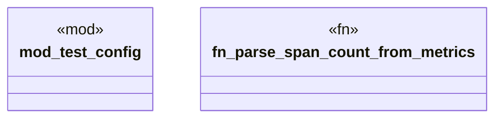

# `tests/integration/otel_validation_tests.rs`

Source SHA-256: `cfcf28cd49bc477e87ceb9a6293fafc766be79af6f284f92fe951fae495c7892`

## Dependencies

- `chicago_tdd_tools::prelude::*`
- `reqwest`
- `serde_json::Value`
- `std::collections::HashMap`
- `std::process::Command`
- `std::time::Duration`
- `test_config::{http_connection_timeout, integration_timeout}`
- `tokio`

## Standing

- Structural parse: `ALIVE`
- Runtime behavior: `UNKNOWN`
