# `tests/integration/packs/lsp_max_pack_test.rs`

Source SHA-256: `6f01f8c11f5357e06eb9147b65ec0b97e137a7f13fa09bb218c955d98367cd16`

```mermaid
classDiagram
    class fn_marketplace_root {
      <<fn>>
    }
    class fn_pack_path {
      <<fn>>
    }
    class fn_template_path {
      <<fn>>
    }
    class fn_render_template {
      <<fn>>
    }
    class fn_test_lsp_max_pack_manifest_loads {
      <<fn>>
    }
    class fn_test_lsp_max_client_pack_manifest_loads {
      <<fn>>
    }
    class fn_test_backend_template_renders_correctly {
      <<fn>>
    }
    class fn_test_cli_template_renders_correctly {
      <<fn>>
    }
    class fn_test_semantics_template_renders_correctly {
      <<fn>>
    }
    class fn_test_build_template_renders_correctly {
      <<fn>>
    }
    class fn_test_conformance_client_template_renders_correctly {
      <<fn>>
    }
    class fn_test_admission_gate_template_renders_correctly {
      <<fn>>
    }
    class fn_test_lsp_max_scaffold_compiles {
      <<fn>>
    }
```

## Dependencies

- `std::path::PathBuf`
- `tempfile::TempDir`
- `tera::{Context, Tera}`

## Standing

- Structural parse: `ALIVE`
- Runtime behavior: `UNKNOWN`
