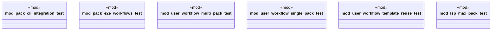

# `tests/integration/packs/mod.rs`

Source SHA-256: `886db1ce3917181de510b8ee72283bef56b6a2e1a8614a1f5f57c7a137b39d86`

## Dependencies

- None observed.

## Standing

- Structural parse: `ALIVE`
- Runtime behavior: `UNKNOWN`
