# `tests/integration/packs/pack_e2e_workflows_test.rs`

Source SHA-256: `666332b53e7bab1fb3681574c72f21b628f3f20d10a62439c59973ba66278c80`

```mermaid
classDiagram
    class fn_test_workflow_generate_project_from_single_pack {
      <<fn>>
    }
    class fn_test_workflow_generate_with_variables {
      <<fn>>
    }
    class fn_test_workflow_validate_pack_before_use {
      <<fn>>
    }
    class fn_test_workflow_compose_multiple_packs {
      <<fn>>
    }
    class fn_test_workflow_check_pack_compatibility {
      <<fn>>
    }
    class fn_test_workflow_merge_rdf_from_multiple_packs {
      <<fn>>
    }
    class fn_test_workflow_execute_sparql_queries_from_pack {
      <<fn>>
    }
    class fn_test_workflow_query_aliases {
      <<fn>>
    }
    class fn_test_workflow_install_dependencies_before_generate {
      <<fn>>
    }
    class fn_test_workflow_generate_with_preset_variables {
      <<fn>>
    }
    class fn_test_workflow_handle_missing_template {
      <<fn>>
    }
    class fn_test_workflow_handle_circular_dependencies {
      <<fn>>
    }
    class fn_test_workflow_complete_project_generation {
      <<fn>>
    }
    class fn_test_workflow_multi_pack_project {
      <<fn>>
    }
```

## Dependencies

- `ggen_core::gpack::GpackManifest`
- `ggen_core::{GenContext, Generator, Pipeline}`
- `std::collections::BTreeMap`
- `std::fs`
- `std::path::PathBuf`
- `tempfile::TempDir`

## Standing

- Structural parse: `ALIVE`
- Runtime behavior: `UNKNOWN`
