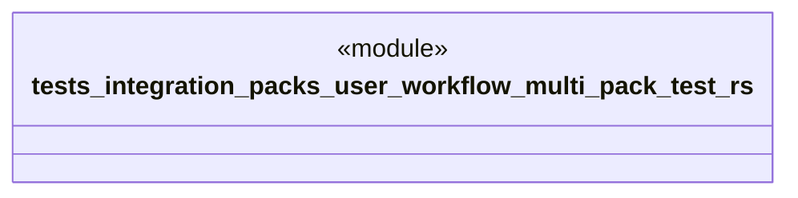

# `tests/integration/packs/user_workflow_multi_pack_test.rs`

Source SHA-256: `2e30746759c1f05b63de663ebce1fa888a8246983a9f55773065b52c90e6e483`

## Dependencies

- `ggen_marketplace::packs_registry::compose::{compose_packs, ComposePacksInput}`
- `ggen_marketplace::packs_registry::metadata::{list_packs, show_pack}`
- `ggen_marketplace::packs_registry::types::CompositionStrategy`
- `std::path::PathBuf`

## Standing

- Structural parse: `ALIVE`
- Runtime behavior: `UNKNOWN`
