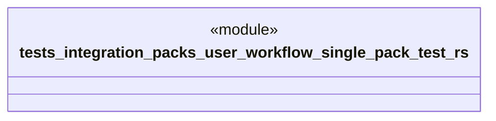

# `tests/integration/packs/user_workflow_single_pack_test.rs`

Source SHA-256: `86518ff5e78e0542a75e17c026751ac4564da332511fb2ad5c4849bb680fc8e6`

## Dependencies

- `ggen_marketplace::marketplace::install::{install_pack_by_id, InstallByIdInput}`
- `ggen_marketplace::packs_registry::generator::{generate_from_pack, GenerateInput}`
- `ggen_marketplace::packs_registry::metadata::{list_packs, show_pack}`
- `std::collections::BTreeMap`
- `std::path::PathBuf`

## Standing

- Structural parse: `ALIVE`
- Runtime behavior: `UNKNOWN`
