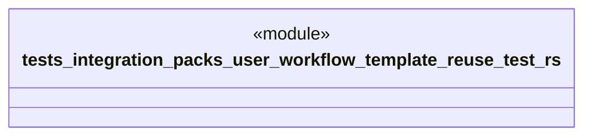

# `tests/integration/packs/user_workflow_template_reuse_test.rs`

Source SHA-256: `21650bb4c04e12ae17628be07458f691fd8caec2735146b08aea80ffab3f7247`

## Dependencies

- `ggen_marketplace::packs_registry::generator::{generate_from_pack, GenerateInput}`
- `ggen_marketplace::packs_registry::metadata::{list_packs, show_pack}`
- `std::collections::BTreeMap`
- `std::path::PathBuf`

## Standing

- Structural parse: `ALIVE`
- Runtime behavior: `UNKNOWN`
