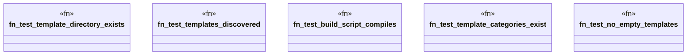

# `tests/integration/template_discovery_test.rs`

Source SHA-256: `0ab060faab17cedcd80f30fcf37342429d2d89a1a265d69166e4bfd73fc666cb`

## Dependencies

- `std::fs`
- `std::path::Path`

## Standing

- Structural parse: `ALIVE`
- Runtime behavior: `UNKNOWN`
