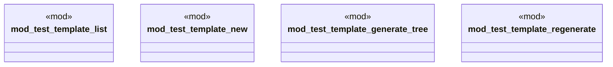

# `tests/integration/template_tests/mod.rs`

Source SHA-256: `c14b233b7e2678a25b195dcc5c73cf119caaf34a21c82928e676e0c6781bae11`

## Dependencies

- None observed.

## Standing

- Structural parse: `ALIVE`
- Runtime behavior: `UNKNOWN`
