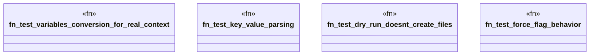

# `tests/integration/template_tests/test_template_generate_tree.rs`

Source SHA-256: `616a5a93b8a413f469a3b60514d0fa0223d3b6c6d0361a414f6263618f5c914b`

## Dependencies

- `std::collections::HashMap`
- `tempfile::TempDir`

## Standing

- Structural parse: `ALIVE`
- Runtime behavior: `UNKNOWN`
