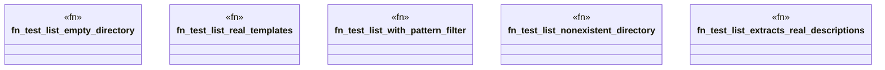

# `tests/integration/template_tests/test_template_list.rs`

Source SHA-256: `7ba91a115f3a2b995b6c9b2b60c68fb322fe38f35337c19a97e78c4c7437d19e`

## Dependencies

- `ggen_cli::domain::template::{list_templates, ListFilters, TemplateSource}`
- `std::fs`
- `tempfile::TempDir`

## Standing

- Structural parse: `ALIVE`
- Runtime behavior: `UNKNOWN`
