# `tests/integration/template_tests/test_template_new.rs`

Source SHA-256: `d668af1ec6b3d6b34a2b07ac2b6d66630ca9eca84bcdea4f3f1a29ac62dd3bad`

```mermaid
classDiagram
    class fn_test_create_real_rust_template {
      <<fn>>
    }
    class fn_test_create_real_python_template {
      <<fn>>
    }
    class fn_test_create_real_typescript_template {
      <<fn>>
    }
    class fn_test_create_generic_template_fallback {
      <<fn>>
    }
    class fn_test_duplicate_template_fails {
      <<fn>>
    }
    class fn_test_template_directory_auto_created {
      <<fn>>
    }
    class fn_test_template_content_has_valid_frontmatter {
      <<fn>>
    }
    class fn_test_read_written_template {
      <<fn>>
    }
```

## Dependencies

- `ggen_cli::domain::template::{generate_template_content, TemplateService}`
- `std::fs`
- `tempfile::TempDir`

## Standing

- Structural parse: `ALIVE`
- Runtime behavior: `UNKNOWN`
