# `tests/integration/template_tests/test_template_regenerate.rs`

Source SHA-256: `6d967877116e79e24e2ade90ae2bd40017244e6b667fe747a56c4538d2259df3`

```mermaid
classDiagram
    class fn_test_parse_real_merge_strategies {
      <<fn>>
    }
    class fn_test_regenerate_creates_new_file {
      <<fn>>
    }
    class fn_test_regenerate_merges_existing_file {
      <<fn>>
    }
    class fn_test_calculate_hash_consistency {
      <<fn>>
    }
    class fn_test_regenerate_respects_fail_on_conflict {
      <<fn>>
    }
    class fn_test_regenerate_multiple_times_idempotent {
      <<fn>>
    }
    class fn_test_hash_changes_with_content {
      <<fn>>
    }
```

## Dependencies

- `ggen_cli::domain::template::regenerate::{calculate_hash, parse_merge_strategy, regenerate_with_merge}`
- `ggen_core::MergeStrategy`
- `std::fs`
- `tempfile::TempDir`

## Standing

- Structural parse: `ALIVE`
- Runtime behavior: `UNKNOWN`
