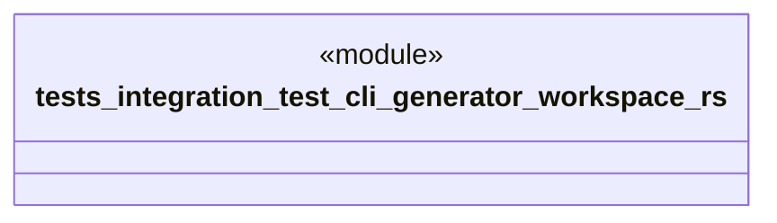

# `tests/integration/test_cli_generator_workspace.rs`

Source SHA-256: `102e22e91ecea17235bc7a42c7ce588871c734fe677abb865903ebbabca8b695`

## Dependencies

- `assert_fs::TempDir`
- `assert_fs::prelude::*`
- `chicago_tdd_tools::prelude::*`
- `std::fs`
- `std::path::Path`

## Standing

- Structural parse: `ALIVE`
- Runtime behavior: `UNKNOWN`
