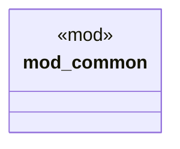

# `tests/integration/test_determinism.rs`

Source SHA-256: `c486d4026d74d9249c7293dcc8a9bd90dc5d59b81492e2180c705fcf82daeba4`

## Dependencies

- `chicago_tdd_tools::prelude::*`
- `common::{create_temp_dir, write_file_in_temp}`
- `ggen_core::{GenContext, Generator, Pipeline}`
- `std::collections::BTreeMap`
- `std::fs`
- `std::path::PathBuf`
- `tempfile::TempDir`

## Standing

- Structural parse: `ALIVE`
- Runtime behavior: `UNKNOWN`
