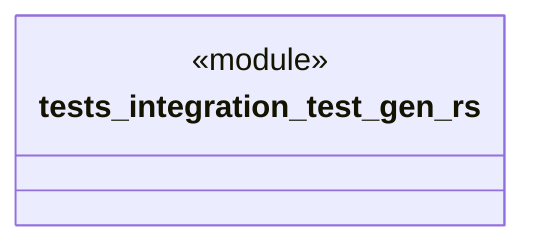

# `tests/integration/test_gen.rs`

Source SHA-256: `8074bbacc7410d0639f9871b0b2b4472458ca68d103158df256da75a4b93025b`

## Dependencies

- `chicago_tdd_tools::prelude::*`
- `std::process::Command`
- `std::str`

## Standing

- Structural parse: `ALIVE`
- Runtime behavior: `UNKNOWN`
