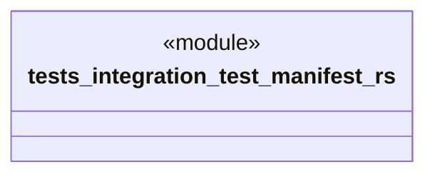

# `tests/integration/test_manifest.rs`

Source SHA-256: `63138d3ee3cb4484aeb78b2527a08d5ce45b148daf231ff9ae46c7eab7152ea9`

## Dependencies

- `chicago_tdd_tools::prelude::*`
- `ggen_config::manifest::{ManifestInputs, compute_manifest_key}`
- `std::collections::BTreeMap`

## Standing

- Structural parse: `ALIVE`
- Runtime behavior: `UNKNOWN`
