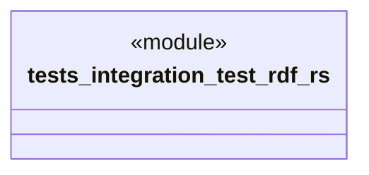

# `tests/integration/test_rdf.rs`

Source SHA-256: `eb0978d9640b36bd73c9520b1667311ec15fb43ab574e174e95fd47a3830ca34`

## Dependencies

- `chicago_tdd_tools::prelude::*`
- `ggen_core::rdf`
- `std::path::Path`

## Standing

- Structural parse: `ALIVE`
- Runtime behavior: `UNKNOWN`
