# `tests/integration/test_refactoring_verification.rs`

Source SHA-256: `39e1bb4dc6f1fd0e3fb5c98050c026c8c29d839532c1d6bfe579c7ebc0ed2050`

```mermaid
classDiagram
    class struct_UserOld {
      <<struct>>
      +"id: u64"
      +"name: String"
      +"email: String"
      +"age: u32"
      +"address: String"
      +"phone: String"
    }
    class fn_create_test_user_old {
      <<fn>>
    }
    class trait_TestFixture {
      <<trait>>
      +"with_config(config: Self::Config) -~ Self"
      +"build(self) -~ Self::Output"
    }
    class struct_User {
      <<struct>>
      +"id: u64"
      +"name: String"
      +"email: String"
      +"age: u32"
    }
    class struct_UserFixture {
      <<struct>>
      +"id: u64"
      +"name: String"
      +"email: String"
      +"age: u32"
    }
    class struct_DeterministicRng {
      <<struct>>
      +"seed: u64"
    }
    class struct_RefactoringMetrics {
      <<struct>>
      +"before_lines: usize"
      +"after_lines: usize"
      +"before_complexity: usize"
      +"after_complexity: usize"
    }
    class mod_tests {
      <<mod>>
    }
    note "DeterministicRng"
    note "RefactoringMetrics"
    note "UserFixture"
```

## Dependencies

- `std::collections::HashMap`
- `std::marker::PhantomData`
- `std::time::{Duration, Instant}`
- `super::*`

## Standing

- Structural parse: `ALIVE`
- Runtime behavior: `UNKNOWN`
