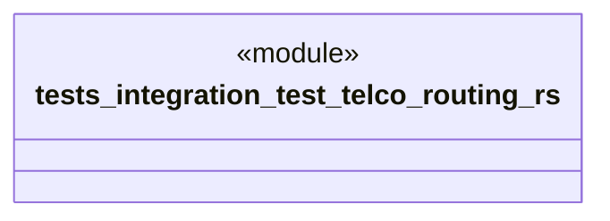

# `tests/integration/test_telco_routing.rs`

Source SHA-256: `7f64a43d35b9c743365a1feb599dd2815adb986c1de6f6a732357e93b7ddb8c1`

## Dependencies

- `ggen_lsp::a2a_mcp::a2a_generated::converged::ConvergedMessage`
- `ggen_lsp::a2a_mcp::a2a_generated::handlers::HandlerFactory`

## Standing

- Structural parse: `ALIVE`
- Runtime behavior: `UNKNOWN`
