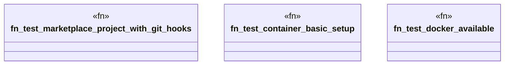

# `tests/integration/testcontainer_marketplace_git_hooks.rs`

Source SHA-256: `718ea786a9943d95dc3ce1bad2658ce950d6159bfe4f3f0b725a0479c3030611`

## Dependencies

- `std::process::Command`
- `testcontainers::{core::WaitFor, runners::SyncRunner, GenericImage, ImageExt}`

## Standing

- Structural parse: `ALIVE`
- Runtime behavior: `UNKNOWN`
