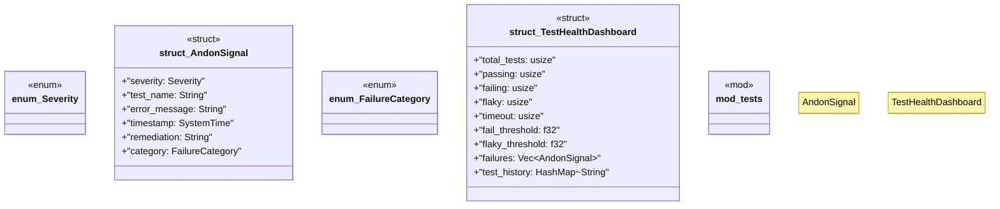

# `tests/lean_quality/andon_system.rs`

Source SHA-256: `8f5b9b21ed1a6d11755a76a692f3923825fe2e86621bf8142572348f1c91ca42`

## Dependencies

- `serde::{Serialize, Deserialize}`
- `std::collections::HashMap`
- `std::time::{SystemTime, Duration}`
- `super::*`

## Standing

- Structural parse: `ALIVE`
- Runtime behavior: `UNKNOWN`
