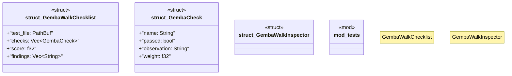

# `tests/lean_quality/gemba_walk.rs`

Source SHA-256: `577f20c0c821572a61cbccb4abd1c35d3754fa40e6350c9fdbeda4a3a6c49e08`

## Dependencies

- `serde::{Serialize, Deserialize}`
- `std::path::PathBuf`
- `std::process::Command`
- `std::time::{Duration, Instant}`
- `super::*`

## Standing

- Structural parse: `ALIVE`
- Runtime behavior: `UNKNOWN`
