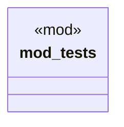

# `tests/otel_validation/capabilities.rs`

Source SHA-256: `9b7d019f220c61443dac0dfafafa19b9ec9b7dd188985c6b788d95fee1e85226`

## Dependencies

- `std::time::Instant`
- `super::*`

## Standing

- Structural parse: `ALIVE`
- Runtime behavior: `UNKNOWN`
