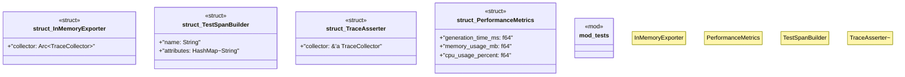

# `tests/otel_validation/collectors.rs`

Source SHA-256: `03fa63c7fae2f7ab6c7a974545af4df214d78e99deb044919d196df6cbf8bed4`

## Dependencies

- `std::sync::Arc`
- `super::*`

## Standing

- Structural parse: `ALIVE`
- Runtime behavior: `UNKNOWN`
