# `tests/otel_validation/mod.rs`

Source SHA-256: `f86b97bc7bd91d3a81eab169af480fb4525fd4aef1f962546485ecb470afee0c`

```mermaid
classDiagram
    class mod_capabilities {
      <<mod>>
    }
    class mod_collectors {
      <<mod>>
    }
    class mod_validators {
      <<mod>>
    }
    class struct_TraceCollector {
      <<struct>>
      +"spans: Arc~Mutex~Vec~SpanRecord~~~"
      +"metrics: Arc~Mutex~HashMap~String"
    }
    class struct_SpanRecord {
      <<struct>>
      +"name: String"
      +"duration_ms: f64"
      +"attributes: HashMap~String"
      +"status: SpanStatus"
    }
    class enum_SpanStatus {
      <<enum>>
    }
    class struct_TestCollectorLayer {
      <<struct>>
    }
    class struct_ValidationContext {
      <<struct>>
      +"collector: TraceCollector"
      +"config: TelemetryConfig"
    }
    class struct_ValidationResult {
      <<struct>>
      +"capability: String"
      +"success: bool"
      +"duration_ms: f64"
      +"errors: Vec~String~"
      +"spans_validated: usize"
      +"metrics_validated: usize"
    }
    class struct_ValidationReport {
      <<struct>>
      +"results: Vec~ValidationResult~"
      +"total_duration_ms: f64"
      +"success_rate: f64"
    }
    class mod_tests {
      <<mod>>
    }
    note "Default for TraceCollector"
    note "Default for ValidationContext"
    note "Layer~S~ for TestCollectorLayer"
    note "TraceCollector"
    note "ValidationContext"
    note "ValidationReport"
    note "ValidationResult"
```

## Dependencies

- `ggen_core::telemetry::TelemetryConfig`
- `ggen_core::utils::error::{Error, Result}`
- `once_cell::sync::Lazy`
- `std::collections::HashMap`
- `std::sync::Once`
- `std::sync::{Arc, Mutex}`
- `std::time::Instant`
- `super::*`
- `tracing::Subscriber`
- `tracing::span::{Attributes, Id}`
- `tracing::{info, instrument}`
- `tracing_subscriber::Layer`
- `tracing_subscriber::layer::Context`
- `tracing_subscriber::layer::SubscriberExt`
- `tracing_subscriber::util::SubscriberInitExt`

## Standing

- Structural parse: `ALIVE`
- Runtime behavior: `UNKNOWN`
