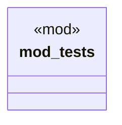

# `tests/otel_validation/validators.rs`

Source SHA-256: `3cfa926c060ca0da7b6fd0ccb3257af22554b010680466414138f0f1caaf006a`

## Dependencies

- `capabilities::*`
- `std::time::Instant`
- `super::*`

## Standing

- Structural parse: `ALIVE`
- Runtime behavior: `UNKNOWN`
