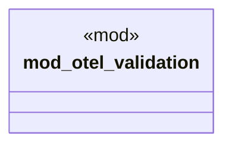

# `tests/otel_validation_tests.rs`

Source SHA-256: `65fd8fe2f59d98f70a76e827058f858b9c9890f692aa609918b0c62f6af0f78f`

## Dependencies

- `anyhow::Result`
- `collectors::PerformanceMetrics`
- `otel_validation::*`

## Standing

- Structural parse: `ALIVE`
- Runtime behavior: `UNKNOWN`
