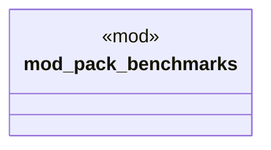

# `tests/performance/packs/mod.rs`

Source SHA-256: `272360532c9da27eb93960b3f2b4e9f4fef8b0e9b440278b57c7fcf524585b38`

## Dependencies

- None observed.

## Standing

- Structural parse: `ALIVE`
- Runtime behavior: `UNKNOWN`
