# `tests/performance/packs/pack_benchmarks.rs`

Source SHA-256: `91755b9939b2a83e6789275275938a51ff179a2e31f7aa7cb7a0827f471df61e`

```mermaid
classDiagram
    class fn_bench_load_single_manifest {
      <<fn>>
    }
    class fn_bench_load_multiple_manifests {
      <<fn>>
    }
    class fn_bench_discover_templates {
      <<fn>>
    }
    class fn_bench_discover_all_files {
      <<fn>>
    }
    class fn_bench_compose_multiple_packs {
      <<fn>>
    }
    class fn_bench_resolve_dependencies {
      <<fn>>
    }
    class fn_bench_large_pack_discovery {
      <<fn>>
    }
    class fn_bench_many_pack_list {
      <<fn>>
    }
```

## Dependencies

- `criterion::{black_box, criterion_group, criterion_main, Criterion}`
- `ggen_core::gpack::GpackManifest`
- `std::path::PathBuf`

## Standing

- Structural parse: `ALIVE`
- Runtime behavior: `UNKNOWN`
