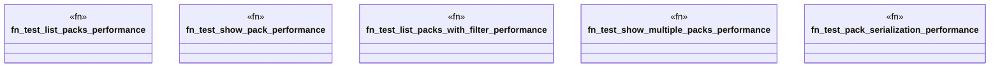

# `tests/performance/packs_performance_test.rs`

Source SHA-256: `3cf3b928a2d203fb6e7a404f8ab5d2e6b6f2f39f72879b893f56a028bb1eabf1`

## Dependencies

- `ggen_core::domain::packs::{ compose_packs, generate_from_pack, install_pack, list_packs, show_pack, ComposePacksInput, CompositionStrategy, GenerateInput, InstallInput, }`
- `ggen_core::domain::packs::{Pack, PackTemplate}`
- `std::collections::BTreeMap`
- `std::collections::HashMap`
- `std::path::PathBuf`
- `std::time::Instant`

## Standing

- Structural parse: `ALIVE`
- Runtime behavior: `UNKNOWN`
